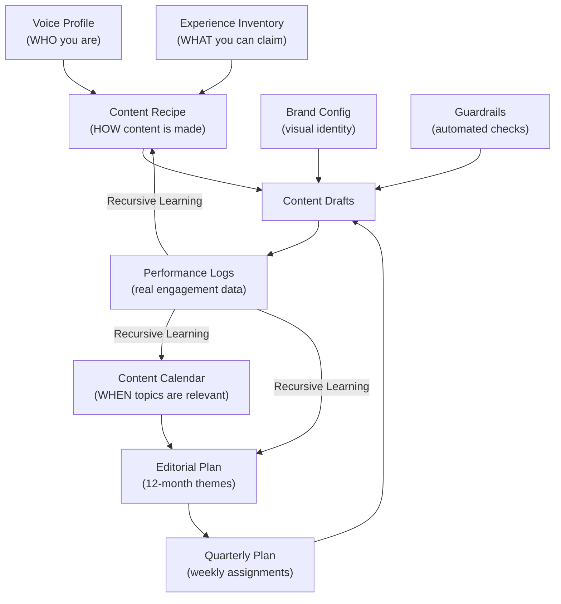

# Capable Wealth Content System: Your Guide

> This document explains the entire Capable Wealth content system in plain language. It walks you through what each document does, how the pieces fit together, and exactly what you need to do -- weekly, monthly, quarterly, and annually -- to keep the system running and improving. You do not need to use any software to follow this guide.

**Companion document:** The technical command center for AI-assisted content production lives in `START_HERE.md`. That file is for your content operator (or for use in Cursor). This guide is for you.

---

## Part 1: What This System Is (and Isn't)

The Capable Wealth content system is a set of interconnected documents that capture your voice, define your audience, plan your content, enforce accuracy, and learn from performance data over time. Together, they allow content to be produced at scale while sounding like you, staying factually grounded, and improving with every cycle.

### What the system handles automatically

- Matching your voice and tone across every piece of content
- Enforcing accuracy (no fabricated stories, no stale facts, no misleading claims)
- Aligning content timing to financial deadlines, tax seasons, and market events
- Translating your expertise into language that resonates with orthopedic surgeons
- Producing content in the right formats for each platform (blog, LinkedIn, YouTube, Facebook)
- Learning from performance data to refine what works

### What requires your input

- Reviewing drafts for voice accuracy ("Does this sound like me?")
- Providing real stories and experiences to expand what the system can draw from
- Sharing platform analytics so the system can learn from real engagement data
- Approving plans and adjusting direction when your priorities shift
- Flagging anything that feels wrong, off-brand, or inaccurate

The core promise: every piece of content should sound like you wrote it, be grounded in things you can actually claim, and get better over time because the system learns from what your audience responds to.

---

## Part 2: The Documents and What They Do

The system is built from layers. Each layer handles a different question. Here they are in the order you should understand them.

### Layer 1: Identity -- Who You Are as a Communicator

**Voice Profile** (`brand/voice-profile.md`)

This is the most important document in the system. It captures who you are as a writer and communicator, distilled from your 126 original blog posts. It documents your background, your core beliefs (wealth is control, mindset over mechanics, balance between present and future), your rhetorical style, your structural patterns (the 6-step DNA: hook, reframe, core teaching, math example, philosophical tie-back, sign-off), and your anti-patterns (things you would never say or do).

When reviewing content, this is the document to hold it against. If a draft does not sound like you, the voice profile is where the answer lives.

**When you should read it:** At least once in full, and any time content feels "off." You do not need to memorize it -- the system references it automatically -- but understanding it helps you give better feedback.

---

### Layer 2: Integrity -- What You Can and Cannot Claim

**Experience Inventory** (`brand/experience-inventory.md`)

This document is the source of truth for every claim made in your content. It catalogs your professional facts, your practice profile, your surgeon and physician experience, verified client stories, knowledge areas (practiced vs. studied vs. familiar), approved personal anecdotes, aspirational positioning, and off-limits topics.

The system uses three classifications for stories and examples:

| Classification | What it means | When it's used |
|---------------|---------------|----------------|
| **REAL-ANONYMIZED** | A real client story from your practice, with details changed for privacy | Only when the story is logged in the inventory as a Verified Story |
| **ILLUSTRATIVE** | A hypothetical but realistic example to demonstrate a concept | When no real story exists but the concept needs a concrete scenario |
| **GENERAL-PRINCIPLE** | Teaching the financial principle itself, without any client narrative | Default when neither of the above applies |

This is the document that keeps your content honest. If something is not in the inventory, the system cannot present it as real experience.

**When you should update it:** Any time you have a new client story worth sharing, a new credential or milestone, a new topic you have practiced (not just studied), or a new off-limits item. The more complete this document is, the richer and more authentic your content becomes.

**How to populate it:** Use the Experience Interview Guide (`brand/experience-interview-guide.md`), which contains 45 structured questions across 8 sections designed to extract the information the inventory needs.

---

### Layer 3: Strategy -- How Content Gets Made

**Content Recipe** (`brand/content-recipe.md`)

This is the production playbook. At 870 lines, it is the most detailed document in the system. You do not need to read it end-to-end. Here is what each section covers so you know where to look when something matters:

| Section | What it covers |
|---------|---------------|
| 1. Content Value Flow | How content creates value: audience need to discovery to engagement to advocacy |
| 2. Audience Translation Matrix | The shift from your original general audience to orthopedic surgeons 45-65 |
| 3. Voice Calibration Guide | What to keep, elevate, retire, and add when adapting your voice for surgeons |
| 4. Content as Building Blocks | The 8-step production workflow: Research, Brief, Draft, Relevance, Voice, Visual, Quality Gate, Publish |
| 5. Research and Relevance Filter | How content stays current with tax law, market conditions, and industry changes |
| 5.1. Content Integrity Filter | How stories and claims are validated against the Experience Inventory |
| 6. Human Checkpoints | Where you review and approve before content moves forward |
| 7. Content Architecture Templates | Format specs for each platform: blog, LinkedIn, YouTube, Facebook |
| 8. Topic Mapping | How your original themes translate to surgeon-relevant topics |
| 9. Language and Terminology Guide | Words and phrases calibrated for surgeons (and which ones to avoid) |
| 10. Visual Asset Guidelines | How branded images are specified for AI generation |
| 11. Recursive Learning Loop | The 5-stage process for learning from performance data and improving |
| 12. Standard Draft File Format | How every draft file is structured (metadata, visuals, content, checklist) |
| 13. Quality Checklist | The final gate every piece must pass before publishing |
| 14. Example Transformations | Before/after examples showing voice calibration in action |

**When you should reference it:** You do not need to use this document directly. It guides the content production process. But if you want to understand why a draft is structured a certain way, or what quality gate it passed through, the answer is here.

---

### Layer 4: Timing -- When to Publish What

**Content Calendar** (`brand/content-calendar.md`)

This document maps when content should address which topics. It operates on four layers:

1. **Static Annual Cycles** -- Predictable financial events and deadlines that create natural content windows (tax season, contribution limit changes, quarterly reviews, year-end planning). Content leads these dates by 4-6 weeks.
2. **Dynamic Research Checkpoints** -- Monthly scans for Fed decisions, new legislation, market movements, IRS guidance, and orthopedic industry news. These can shift the content plan.
3. **Signal Triggers** -- Unplanned events (emergency legislation, market disruption, major industry news) that warrant immediate content.
4. **Research Sources** -- The specific sources monitored for each type of update.

**When you should reference it:** When reviewing the editorial plan or quarterly plan to understand why certain topics are scheduled when they are. Also useful when something happens in the financial or medical world and you want to know if it should affect the content plan.

---

### Layer 5: Planning -- From Annual Themes to Weekly Assignments

**Editorial Plan** (`brand/editorial-plan-2026.md`)

The 12-month plan covering March 2026 through February 2027. Each month has a theme, 3-4 content ideas with working titles and target angles, and relevance flags noting when dynamic research is especially critical. This is the strategic layer -- it decides what topics are covered and when.

**Quarterly Plan** (`brand/quarterly-plan-Q2-2026.md`)

The current quarter broken into weekly assignments by channel. Each week has an anchor blog post, LinkedIn posts, Facebook posts, a YouTube/podcast concept, and timing rationale. This is the operational layer -- it decides exactly what gets produced each week.

**How they connect:** The editorial plan sets the themes. The quarterly plan turns themes into specific assignments. Content batches (the actual drafts) are produced from the quarterly plan.

---

### Layer 6: Visual Identity -- How Content Looks

**Brand Configuration** (`brand/brand_config.json`)

Defines the visual standards: colors (Deep Muted Blue, Antique Gold, Charcoal, Warm Ivory, Soft Sage), typography (Playfair Display for headings, Inter for body text), logo usage, spacing, and imagery rules. Also includes calibrated voice and tone attributes that guide the system's language choices.

**When you should reference it:** Rarely. This file is used automatically when generating visual assets and formatted content. But if you notice colors, fonts, or imagery that look wrong, this is where the standards live.

---

### Layer 7: Measurement -- Learning from What Works

**Performance Log Template** (`brand/performance-log-template.md`)

A standardized format for capturing real engagement data from your platform analytics (LinkedIn, YouTube, Facebook, blog). You copy the template, fill it in with actual numbers from each platform's analytics dashboard, and this data feeds the Recursive Learning Loop -- the process that makes the system smarter over time.

**What it captures:** Impressions, reach, likes, comments, shares, saves, click-throughs, platform-specific metrics (watch time, profile visits, subscriber growth), demographic data, and qualitative feedback (notable comments, direct messages).

**When you use it:** Before each learning cycle (roughly monthly or after each content batch has been live for 14+ days). The system cannot learn without real data.

---

### Layer 8: Guardrails -- Automated Quality Controls

Three automated rules run behind the scenes when content is being produced. You do not interact with these directly, but knowing what they do helps you understand why content comes out the way it does.

| Guardrail | What it prevents |
|-----------|-----------------|
| **Content Integrity** | Fabricated stories, unsupported claims, experience you have not verified. Forces every client story to be classified and traceable to the Experience Inventory. |
| **Content Production Batch** | Inconsistent output. Enforces weekly volume (1 blog, 1 podcast, 5 LinkedIn, 5 Facebook, 2-5 clips), file naming, draft format, and visual asset standards. |
| **Content-Date Alignment** | Temporal dishonesty. Prevents content from referencing events, deadlines, or data as having occurred if the publication date comes before them. |

---

### How the Documents Connect

---

## Part 3: The Content Lifecycle

Here is how a single piece of content moves from idea to published to measured, and which document governs each step.

### Step 1: Idea

The editorial plan identifies the monthly theme and content ideas. The content calendar confirms the timing is right (aligned to financial deadlines, seasonal relevance, or signal-driven events).

**Governed by:** Editorial Plan, Content Calendar

### Step 2: Brief

The quarterly plan assigns the idea to a specific week, channel (blog, LinkedIn, YouTube, Facebook), and angle. It specifies the hook, the core insight, and how the piece connects to the week's other content.

**Governed by:** Quarterly Plan

### Step 3: Draft

The content recipe's 8-step building block workflow produces the draft: research the topic, write a brief, draft the content, validate relevance, validate voice, create visual asset specifications, run the quality checklist, and prepare for publishing.

**Governed by:** Content Recipe (Sections 4-7)

### Step 4: Integrity Check

Every claim, story, and example in the draft is cross-referenced against the Experience Inventory. Stories are classified as REAL-ANONYMIZED, ILLUSTRATIVE, or GENERAL-PRINCIPLE. Unsupported claims are flagged and reframed.

**Governed by:** Experience Inventory, Content Integrity guardrail

### Step 5: Voice Check

The draft is evaluated against the Voice Profile. Does it open with a story? Does it contain a contrarian reframe? Does it use surgeon-level numbers? Does it tie tactics to philosophy? Does it avoid anti-patterns?

**Governed by:** Voice Profile, Content Recipe (Section 3)

### Step 6: Relevance Check

Facts, figures, tax rates, contribution limits, and legal references are validated against current conditions. Temporal alignment is checked against the publication date.

**Governed by:** Content Calendar, Content-Date Alignment guardrail

### Step 7: Your Review

You review the draft. Does this sound like you? Are the claims accurate? Would you be comfortable saying this to a surgeon sitting across from you?

**Governed by:** Content Recipe (Section 6, Human Checkpoints)

### Step 8: Publish

Approved content is finalized and delivered for publishing on the assigned platform.

### Step 9: Measure

After content has been live for 14+ days, real performance data is logged using the Performance Log Template. Impressions, engagement, demographics, qualitative feedback.

**Governed by:** Performance Log Template

### Step 10: Learn

The Recursive Learning Loop analyzes performance data across a batch: what outperformed, what underperformed, what patterns emerge. Insights feed back into the Content Recipe, Content Calendar, and Editorial Plan. The system gets smarter.

**Governed by:** Content Recipe (Section 11)

---

## Part 4: Your Maintenance Rhythm

The system works best when you contribute at regular intervals. Here is what to do and when.

### Every Content Batch (Weekly or Biweekly)

**Time commitment:** 30-60 minutes

- [ ] Review drafts for voice accuracy -- flag anything that does not sound like you, with specific notes on what feels off
- [ ] Check claims and stories -- does anything reference an experience you have not actually had?
- [ ] Approve, request revisions, or reject each piece
- [ ] Note any new stories or anecdotes that came up in your practice this week that could be added to the inventory

### Monthly

**Time commitment:** 1-2 hours

- [ ] Pull analytics data from LinkedIn, YouTube, Facebook, and your blog/website
- [ ] Fill in a performance log using the template (`brand/performance-log-template.md`) and save it to `outputs/performance-logs/`
- [ ] Review the monthly research scan results (tax law changes, market events, industry news) and flag anything the content plan should respond to
- [ ] Share any new client stories, experiences, or anecdotes that should be added to the Experience Inventory
- [ ] Review upcoming content in the quarterly plan -- does the direction still feel right?

### Quarterly

**Time commitment:** 2-3 hours

- [ ] Complete the Experience Interview (using `brand/experience-interview-guide.md`) to refresh the Experience Inventory with new stories, credentials, and knowledge areas
- [ ] Review the quarterly plan against what was actually produced and what performed well
- [ ] Approve the next quarter's plan (topics, angles, channel mix)
- [ ] Participate in the Recursive Learning cycle review: what worked, what did not, what to experiment with next
- [ ] Flag any shifts in your positioning, your practice focus, or your target audience

### Annually

**Time commitment:** 3-4 hours

- [ ] Review the editorial plan for the coming year -- are the monthly themes still right?
- [ ] Update the voice profile if your style, philosophy, or approach has evolved
- [ ] Review brand standards (colors, fonts, imagery) and confirm they still represent the brand you want
- [ ] Assess the content calendar's annual cycles -- have any recurring financial events changed (new legislation, shifted deadlines)?
- [ ] Set strategic goals for the year: audience growth targets, new platforms, new content formats, positioning shifts

---

## Part 5: How to Update Each Document

Each document in the system has its own update rhythm and its own triggers. Here is when and how each one gets updated, what you need to provide, and where changes cascade.

### Voice Profile (`brand/voice-profile.md`)

| | |
|---|---|
| **Update frequency** | Rarely. Annually at most, unless your voice evolves significantly. |
| **What triggers an update** | Content consistently feels off-brand despite passing voice checks. You adopt new rhetorical patterns. Your philosophy or positioning shifts. |
| **What you provide** | Specific feedback: "I would never say it this way" or "I have started saying things like this." New writing samples if your style has evolved. |
| **What the system handles** | Analyzing your feedback and samples to update the profile. |
| **Cascade effects** | Changes here affect every future piece of content. The Voice Calibration Guide (content recipe Section 3) may also need updating. |

### Experience Inventory (`brand/experience-inventory.md`)

| | |
|---|---|
| **Update frequency** | Quarterly via the Experience Interview, plus ad hoc when notable stories arise. |
| **What triggers an update** | New client engagement with a teachable outcome. New credential or milestone. New topic moved from "studied" to "practiced." A story you told at a conference that could be reused. A new off-limits item. |
| **What you provide** | The story details: client type, problem, recommendation, outcome, timeframe, and how it can be framed. Or complete the Experience Interview Guide. |
| **What the system handles** | Formatting the entry, anonymizing details, classifying the story, and updating related documents. |
| **Cascade effects** | New verified stories unlock REAL-ANONYMIZED classification for related content topics. New knowledge area entries change how the system frames your authority on those topics. |

### Content Recipe (`brand/content-recipe.md`)

| | |
|---|---|
| **Update frequency** | Quarterly, informed by the Recursive Learning cycle. |
| **What triggers an update** | Performance data reveals workflow bottlenecks. A content format consistently underperforms. New platform requirements emerge. Quality checklist items prove too strict or too lenient. |
| **What you provide** | Your observations about what is and is not working in the production process. |
| **What the system handles** | Analyzing performance data and recommending specific updates to workflow, templates, or quality gates. |
| **Cascade effects** | Changes here affect the production process for all future content. Updated quality gates change what passes review. |

### Content Calendar (`brand/content-calendar.md`)

| | |
|---|---|
| **Update frequency** | Monthly through research scans. Quarterly through the Recursive Learning cycle. |
| **What triggers an update** | New legislation, tax law changes, market events, industry news. A signal trigger fires (emergency content needed). Research reveals new deadlines or events relevant to surgeons. |
| **What you provide** | Flag any financial or industry events you are hearing about from clients, colleagues, or conferences. |
| **What the system handles** | Running monthly research scans, updating the calendar, and flagging content that may be affected. |
| **Cascade effects** | Calendar changes can shift the editorial plan and quarterly plan. Content already drafted may need relevance re-validation. |

### Editorial Plan (`brand/editorial-plan-2026.md`)

| | |
|---|---|
| **Update frequency** | Quarterly review. Rebuilt annually for the coming year. |
| **What triggers an update** | Recursive Learning reveals audience preferences the plan did not account for. Calendar updates shift topic timing. Your strategic priorities change. |
| **What you provide** | Approval or redirection of monthly themes and content ideas. |
| **What the system handles** | Proposing updates based on performance data and calendar changes. |
| **Cascade effects** | Editorial plan changes cascade to the quarterly plan and future content batches. |

### Quarterly Plan (`brand/quarterly-plan-Q[N]-2026.md`)

| | |
|---|---|
| **Update frequency** | Created fresh each quarter. Minor adjustments during the quarter based on performance or events. |
| **What triggers an update** | A signal trigger fires mid-quarter. Performance data suggests a topic pivot. You want to address something timely. |
| **What you provide** | Approval of the quarterly plan. Any mid-quarter adjustments you want to make. |
| **What the system handles** | Building the plan from the editorial plan, drilling down to weekly assignments by channel. |
| **Cascade effects** | Changes here directly affect what content gets produced in the current batch cycle. |

### Brand Configuration (`brand/brand_config.json`)

| | |
|---|---|
| **Update frequency** | Rarely. Only when the visual brand evolves. |
| **What triggers an update** | Rebranding, new logo, updated color palette, new font choices. |
| **What you provide** | New brand assets or direction from your designer. |
| **What the system handles** | Updating the configuration file and propagating changes to templates and visual asset specifications. |
| **Cascade effects** | All future visual assets (images, thumbnails, social cards) will reflect the new standards. |

### Performance Log Template (`brand/performance-log-template.md`)

| | |
|---|---|
| **Update frequency** | Rarely. Only if you change platforms or need to track new metrics. |
| **What triggers an update** | Adding a new platform (e.g., Instagram, TikTok). A platform changes its analytics dashboard and new metrics become available. |
| **What you provide** | Which new metrics you want to track. |
| **What the system handles** | Updating the template structure. |
| **Cascade effects** | Future performance logs will capture the new metrics, giving the Recursive Learning Loop better data. |

---

## Part 6: Quick Decision Guide

When something happens, here is what to do.

| What happened | What to do | Which document is affected |
|--------------|-----------|---------------------------|
| You told a great story at a conference or client meeting | Write down the key details (who, what problem, what you recommended, what happened). Send them to your content operator to add to the Experience Inventory. | Experience Inventory |
| A piece of content does not sound like you | Flag the specific lines or phrases that feel off. Note what you would say instead. This feedback may trigger a Voice Profile refinement. | Voice Profile |
| Tax law changed or new legislation passed | Flag it immediately. This triggers a content calendar signal scan and may require re-validating upcoming content. | Content Calendar, Quarterly Plan |
| A platform is performing well, another is not | Log the data in a performance log. This feeds the Recursive Learning cycle, which will recommend channel strategy adjustments. | Performance Log, Content Recipe |
| You want to shift your positioning or target audience | This is a significant change. It may affect the Voice Profile, Content Recipe, Editorial Plan, and Quarterly Plan. Start with a conversation about what you want to change and why. | Voice Profile, Content Recipe, Editorial Plan |
| You earned a new credential or designation | Add it to the Experience Inventory under Professional Facts. This may unlock new authority framing in content. | Experience Inventory |
| A client asks a question you have never been asked before | Note the question. It may reveal a content gap worth addressing in the editorial plan. | Editorial Plan |
| You notice the same topic keeps outperforming | Flag it during the Recursive Learning review. The system may recommend expanding coverage, creating a series, or building a lead magnet around it. | Content Recipe, Editorial Plan |
| Something is listed as off-limits that should no longer be | Update the Experience Inventory Section 8 to remove it. Content on that topic can then be considered. | Experience Inventory |
| You are preparing for a speaking engagement | Review the editorial plan for related topics. Content can be produced in advance to align with the event and amplify your appearance. | Editorial Plan, Quarterly Plan |

---

## Getting Started

If you are reading this for the first time, here is the recommended path:

1. **Read the Voice Profile** (`brand/voice-profile.md`). This is the foundation. Everything else builds on it.
2. **Skim the Experience Inventory** (`brand/experience-inventory.md`). Understand the structure and note where it needs to be filled in. If it is still a template, schedule time for the Experience Interview.
3. **Review the Content Recipe table of contents** (Part 2 of this guide, Layer 3). You do not need to read all 870 lines, but know which section to reference when you have a question.
4. **Look at the current Quarterly Plan** (`brand/quarterly-plan-Q2-2026.md`). This tells you what content is being produced right now and for the next several weeks.
5. **Set up your rhythm** (Part 4 of this guide). Decide when you will do your weekly reviews, monthly data pulls, and quarterly interviews.

The system is designed to get better over time, but it depends on the loop: produce content, measure results, learn from data, improve. The more consistently you contribute your input and your analytics data, the sharper the system becomes.
