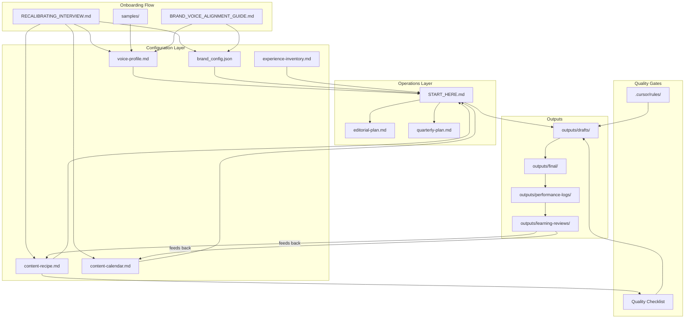

# File Map

This document lists every file in the template, its purpose, where it should live when integrated, and which placeholders it contains.

---

## Document Relationship Diagram

---

## File Inventory

### Top-Level Files

| File | Purpose | Placeholders |
|------|---------|-------------|
| `README.md` | Framework overview; links to integration instructions | `[ORG_NAME]`, `[TAGLINE]` |
| `INTEGRATION_INSTRUCTIONS.md` | Step-by-step setup for existing or new projects | `[ORG_NAME]` |
| `RECALIBRATING_INTERVIEW.md` | Structured questionnaire for onboarding | None (questions are generic) |
| `BRAND_VOICE_ALIGNMENT_GUIDE.md` | How to build voice profile, detect AI giveaways, configure rules | `[ORG_NAME]`, `[PERSON_NAME]`, `[SIGN_OFF_PHRASE]` |
| `START_HERE.md` | Operational command center with session prompts | `[ORG_NAME]`, `[PERSON_NAME]`, `[AUDIENCE]`, `[SIGN_OFF_PHRASE]` |

### Brand Foundation (`brand/`)

| File | Purpose | Placeholders |
|------|---------|-------------|
| `voice-profile.md` | Voice capture document | `[ORG_NAME]`, `[PERSON_NAME]`, `[AUDIENCE]` |
| `content-recipe.md` | Production workflow and quality gates | `[ORG_NAME]`, `[PERSON_NAME]`, `[AUDIENCE]`, `[SIGN_OFF_PHRASE]`, `[AUDIENCE_METAPHORS]`, `[COMPLIANCE_RULE_1]`, `[COMPLIANCE_RULE_2]`, `[REQUIRED_DISCLAIMERS]` |
| `content-calendar.md` | Timing, cycles, deadlines | `[ORG_NAME]`, `[AUDIENCE]`, `[KEY_DEADLINE_1]`, `[KEY_DEADLINE_2]` |
| `brand_config.json` | Visual and tonal standards | `[ORG_NAME]`, `[TAGLINE]`, `[PRIMARY_HEX]`, `[SECONDARY_HEX]`, `[ACCENT_HEX]`, `[LIGHT_NEUTRAL_HEX]`, `[DARK_NEUTRAL_HEX]`, `[MID_NEUTRAL_HEX]`, `[HEADING_FONT]`, `[BODY_FONT]`, `[AUDIENCE]`, `[COMPLIANCE_RULE_1]`, `[COMPLIANCE_RULE_2]`, `[REQUIRED_DISCLAIMERS]`, `[SIGN_OFF_PHRASE]` |
| `experience-inventory.md` | Verifiable claims vault | `[ORG_NAME]`, `[PERSON_NAME]`, `[AUDIENCE]` |
| `experience-interview-guide.md` | Questions to populate inventory | `[ORG_NAME]`, `[PERSON_NAME]`, `[AUDIENCE]` |
| `performance-log-template.md` | Performance data logging format | None (already generic) |
| `system-guide.md` | Stakeholder-facing system explanation | `[ORG_NAME]`, `[PERSON_NAME]`, `[AUDIENCE]` |

### Cursor Rules (`.cursor/rules/`)

| File | Purpose | Placeholders |
|------|---------|-------------|
| `content-production-batch.mdc` | Batch production standards | `[ORG_NAME]` |
| `content-integrity.mdc` | Content integrity enforcement | `[ORG_NAME]`, `[AUDIENCE]`, `[COMPLIANCE_RULE_1]`, `[COMPLIANCE_RULE_2]`, `[REQUIRED_DISCLAIMERS]` |
| `content-date-alignment.mdc` | Temporal validation | `[KEY_DEADLINE_1]`, `[KEY_DEADLINE_2]`, `[KEY_DEADLINE_3]` |

### Scripts (`src/`)

| File | Purpose | Placeholders |
|------|---------|-------------|
| `config.py` | BrandConfig loader | None (reads from brand_config.json) |
| `export_content_batch.py` | Excel export for content batches | None (reads from brand_config.json) |
| `requirements.txt` | Python dependencies | None |

### Other

| File / Directory | Purpose | Placeholders |
|-----------------|---------|-------------|
| `samples/README.md` | Instructions for sample content | None |
| `outputs/drafts/` | Content batch drafts | N/A (directory) |
| `outputs/final/` | Approved content | N/A (directory) |
| `outputs/performance-logs/` | Performance data logs | N/A (directory) |
| `outputs/learning-reviews/` | Learning cycle outputs | N/A (directory) |
| `docs/FILE_MAP.md` | This file | None |

---

## Placeholder Checklist

Complete this checklist after integration to confirm all placeholders have been replaced.

| Placeholder | Replaced? | Value Used |
|-------------|-----------|------------|
| `[ORG_NAME]` | [ ] | |
| `[PERSON_NAME]` | [ ] | |
| `[AUDIENCE]` | [ ] | |
| `[SIGN_OFF_PHRASE]` | [ ] | |
| `[TAGLINE]` | [ ] | |
| `[PRIMARY_HEX]` | [ ] | |
| `[SECONDARY_HEX]` | [ ] | |
| `[ACCENT_HEX]` | [ ] | |
| `[LIGHT_NEUTRAL_HEX]` | [ ] | |
| `[DARK_NEUTRAL_HEX]` | [ ] | |
| `[MID_NEUTRAL_HEX]` | [ ] | |
| `[HEADING_FONT]` | [ ] | |
| `[BODY_FONT]` | [ ] | |
| `[KEY_DEADLINE_1]` | [ ] | |
| `[KEY_DEADLINE_2]` | [ ] | |
| `[KEY_DEADLINE_3]` | [ ] | |
| `[AUDIENCE_METAPHORS]` | [ ] | |
| `[COMPLIANCE_RULE_1]` | [ ] | |
| `[COMPLIANCE_RULE_2]` | [ ] | |
| `[REQUIRED_DISCLAIMERS]` | [ ] | |

---

## brand_config.json Schema Reference

### Required Keys

| Key | Type | Description |
|-----|------|-------------|
| `brand_name` | string | Organization name |
| `tagline` | string | Brand tagline or positioning statement |
| `version` | string | Config version number |
| `colors` | object | Color definitions (primary, secondary, accent, neutrals) |
| `typography` | object | Font families and weights (heading, body) |
| `voice_and_tone` | object | Voice attributes, tone by context, language rules |
| `imagery` | object | Imagery guidelines (audience context, people/environment, disallowed) |
| `channel_config` | object | Active channels with frequency and format specs |

### Optional Keys

| Key | Type | Description |
|-----|------|-------------|
| `color_ratio` | object | Color distribution guideline (e.g., 60/30/10) |
| `type_scale` | object | Font size scale for headings, body, lead text |
| `compliance` | object | Industry-specific compliance rules and disclaimers |
| `page_dimensions` | object | PDF/print dimensions |

### Color Entry Format

Each color in `colors` should have:
- `name` (string): Human-readable color name
- `hex` (string): Hex code including # (e.g., "#243A4B")
- `rgb` (array): RGB values as [R, G, B]
- `usage` (string): Where and when to use this color

### Channel Entry Format

Each channel in `channel_config.channels` should have:
- `name` (string): Platform name
- `active` (boolean): Whether currently producing for this channel
- `posts_per_week` (integer): Target frequency
- `format` (string): Content format description
- `tone_notes` (string): How tone differs on this channel
- `dimensions` (object): Image dimensions `{ width, height }` in pixels
