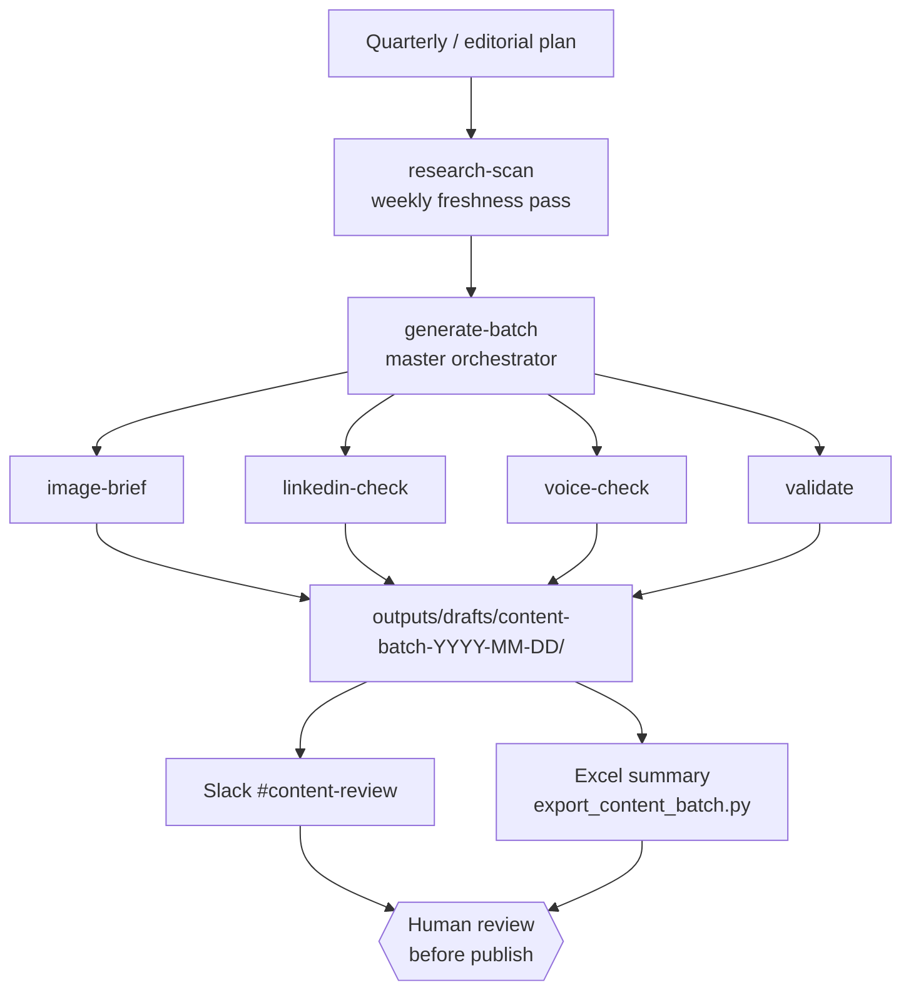
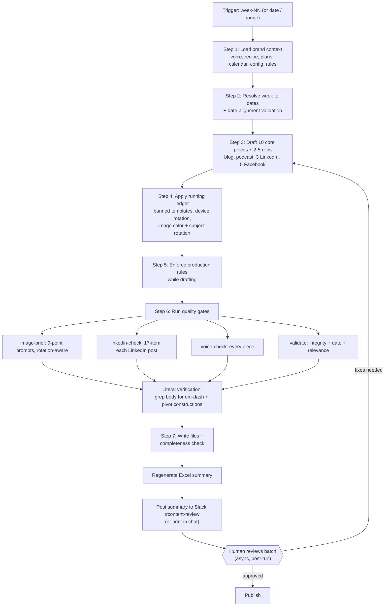
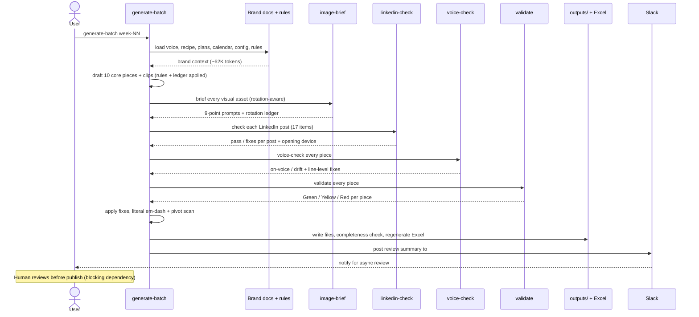
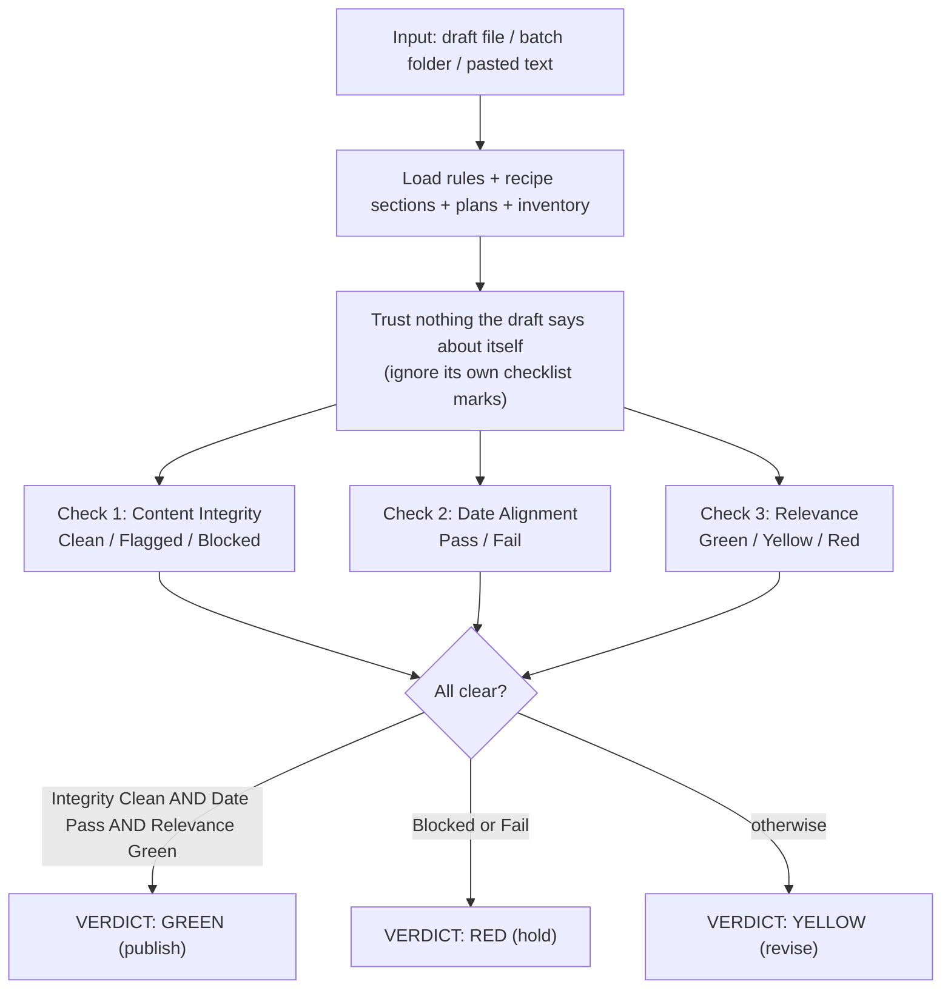

# Workflow Maps

## How these render

GitHub renders **Mermaid** diagrams natively inside fenced ` ```mermaid ` code blocks. You do not need an image, a plugin, or ASCII art. View this file on GitHub (or in any Mermaid-aware Markdown preview) and every diagram below draws as a real flowchart or sequence diagram. If you ever open it in a plain text editor, you will see the Mermaid source, which is still readable.

This is the answer to "can you do a sequence diagram that renders in GitHub": yes, the `sequenceDiagram` block below is exactly that.

---

## 1. The skill map (how the 6 skills relate)



`generate-batch` is the engine. The other five skills are either run before it (`research-scan`) or called by it as gates (`image-brief`, `linkedin-check`, `voice-check`, `validate`). All five gates can also be invoked standalone on any draft.

---

## 2. generate-batch, end to end (flowchart)



> Note: the gates do **not** block execution mid-run. The batch is drafted, gated, fixed, written to disk, and summarized in one pass; the human review happens **after** the run completes, against the folder and the Slack summary. See the time-study (`05-time-study.md`) for where the human-wait time sits.

---

## 3. generate-batch gate orchestration (sequence diagram)



---

## 4. validate, the final gate (flowchart)



---

## Maintaining these diagrams

When a skill's sequence changes, edit the Mermaid source here. Keep node labels short and avoid characters that confuse the Mermaid parser (stick to letters, numbers, commas, and `<br/>` for line breaks). Preview on GitHub to confirm they still render before committing.
