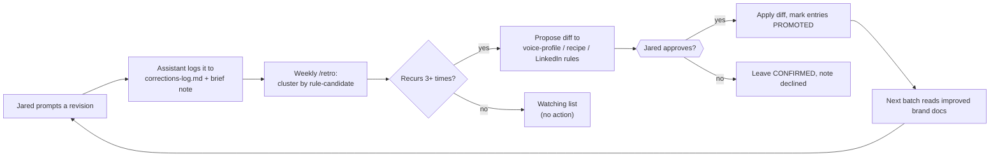

# Recursive Learning Loop

This documents how the harness improves itself over time. The system already promised a "recursive learning cycle" conceptually (see `START_HERE.md` Session 5 and `brand/system-guide.md` Layer 7 / Step 10); this is the concrete mechanism that delivers it.

## The constraint that shapes the design

The harness runs in Claude Cowork, not the cloud API, so there is **no model fine-tuning**. The model's weights never change. The only thing that can improve is the **source-of-truth the skills read** (`voice-profile.md`, `content-recipe.md`, the LinkedIn rules). So "learning" here means exactly one thing:

> The brand docs get better over time, so the same model produces better-aligned content with fewer corrections.

The repo is the memory. That is the only durable learning substrate available, and it is a good one because the skills already read these docs live.

## The signal: prompted corrections, not file edits

The richest learning signal is not Jared hand-editing files. It is the **revision requests he makes in Cowork** ("this feels too salesy, pull it back", "lead with the number, not the question"). A file edit shows *what* changed; a prompted correction usually states the *why*, often as a rule. That "why" is exactly what a brand-doc learning is, so the correction hands it over directly.

Cowork's chat transcript is not accessible programmatically on Max, so the system captures these another way: **the assistant logs each correction itself**, as a side effect of applying it.

## The loop

```
Jared prompts a revision in Cowork
        │   ("too salesy, pull it back")
        ▼
Assistant applies it AND appends a structured entry to
brand/corrections-log.md  +  notes "logged as a preference candidate"
        │   (always-on rule in COWORK_PROJECT_INSTRUCTIONS.md; git versions the log)
        ▼
Weekly /retro skill reads the log, clusters by rule-candidate
        │
        ├─ candidate seen 3+ times  → proposes a diff to the right brand doc
        └─ seen 1-2 times           → "watching" list, no action
        ▼
Jared approves the proposed diff   (guardrail G8: brand docs change only on his approval)
        ▼
Next batch reads the improved brand docs → fewer corrections of that kind → loop tightens
```



## The four design decisions and why

| Decision | Choice | Why |
|---|---|---|
| **What signal** | Prompted revision requests | Captures the *why* (the rule), not just the *what*; works without Cowork API access |
| **How captured** | Assistant logs automatically, with a brief note | Zero friction, structured at capture time; the note lets Jared catch a miscategorization |
| **What promotes a learning** | Recurrence of 3+ (or an explicit "make this a rule") | A single correction must not rewrite a brand doc; the threshold filters noise, which matters because synthesis is weekly |
| **How applied** | `/retro` proposes diffs, Jared approves | Respects guardrail G8 (brand docs change only on his approval); keeps a human in the loop |
| **Cadence** | Weekly | Tight enough to adapt quickly; the recurrence threshold offsets the higher noise of a short window |

## Why this does not drift or collapse

A loop that learns from its **own** output amplifies its own tics and calls it improvement (model collapse). This loop avoids that because its signal is **Jared correcting the machine**, which is an external human signal, not the machine grading itself. The system is being taught, not mirrored.

Real published engagement data (LinkedIn/Facebook metrics) would add a second external signal, the market's verdict. It is intentionally **out of scope for now**; the loop is grounded by human corrections alone, which is sufficient to avoid drift. Engagement can be added later as a second input to `/retro` without changing the loop's shape.

## The artifacts

| Artifact | Role |
|---|---|
| `brand/corrections-log.md` | Append-only behavioral log; the source signal. Entries: date, piece, verbatim request, category, rule-candidate, scope. Status markers: `[WATCHING]` / `[CONFIRMED]` / `[PROMOTED]`. |
| Logging rule in `COWORK_PROJECT_INSTRUCTIONS.md` | The always-on guardrail that makes the assistant log every revision request automatically. |
| `/retro` skill | The weekly synthesis: cluster, count, propose brand-doc diffs, update markers on approval. |

## Boundaries

- Recurrence is counted **by rule-candidate, not verbatim text**; without that, counting is meaningless.
- One-off content requests are logged but never promoted.
- `/retro` proposes; it never edits a brand doc on its own.
- Log history is never deleted; promoted entries are marked, not removed, because `/retro` needs the history to count.
